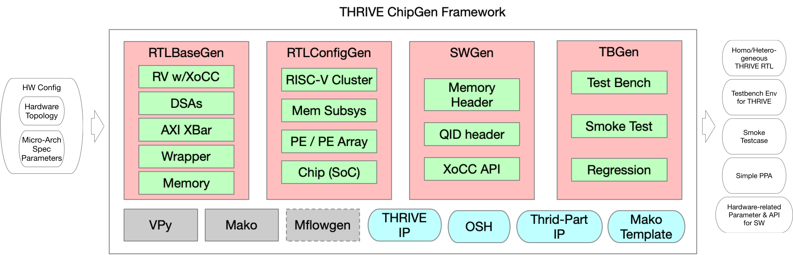
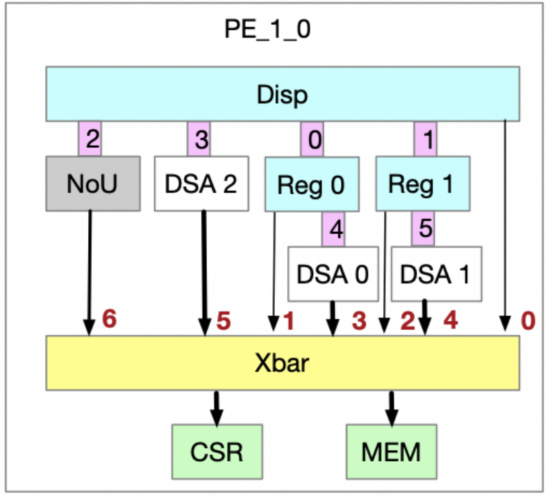
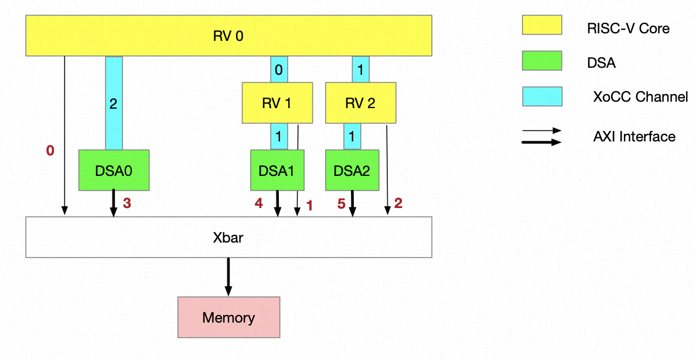

# Introduction
THRIVE-ChipGen (TCG) is a chip generator, which can automatically generate (System)Verilog RTL, testbench, software API, and testcase for verification, using user-defined configuration, for RISC-V centered Dataflow architecture with AI enhancement.
TCG is also known by its another alias Trading Card Game, in which different card combinations can achieve different effects. So, our ambitious goal for TCG project is that different configurations can be used to implement specific hardware architecture for different AI applications.
## TCG Framework Overview
The input of TCG is hardware configurations which may produced by DSE tools. The hardware configurations in TCG include PE topology, PE micro-arch parameters like memory size, number of RISC-V core, DSA configuration, address mapping and so on. With the input configuration, TCG can produce synthsizable RTL for FPAG&ASIC prototyping, corresponding verification environment, and software API for testing.
TCG consists of three components which are:

- mako centered agile design tools
   - VPy is a RTL generation tools for improve coding efficiency and desreasing bug rate. Detailed usage for VPy can be found [here](https://aliyuque.antfin.com/thrive/lor0ag/ry3lhx3d2kud7awp).
   - mako is a python-based template library, which can embedding python code in RTL files and greatly improves design configurability. Detailed description of mako templates can be found [here](https://aliyuque.antfin.com/thrive/lor0ag/xnsnhz0r9od4qf1t).
- IP resource library which are basic building blocks including in-house developing IPs, open-source hardware and third-part IP.
- four generators
   - RTLBaseGen generates basic units depend on hardware configuration, such as RISC-V core with XoCC extension, memory size, AXI interconnect.
   - RTLConfigGen adopts hierachycal integration style to generate all top module for PE-level to chip-level.
   - SWGen and TBGen produce corresponding verification environment, smoke testcase, and software APIs.


## Example Configurations
We provide an example configurations to show how to generate project. The process includes RTLBaseGen (Xuantie risc-v base rtl components), RTLConfigGen (THRIVE configurable RTL Generation), TBGen (Testbench Generation), SWGen (Software header and api Generation), and TCGen (Testcase Generation). The example is configured as:

- 2_2_homo_demo: 2x2 2D Mesh (homogeneous)
- Each PE has:
   - a rv cluster including one dispatcher core for runing OS/firmware and two regular cores for runtime execution
   - an nou and router module for inter-PE communication
   - three dummy DSAs (example DSA module) which connect to rv cluster via XoCC
   - 1MB memory mapped SRAM
   - 1KB memory mapped CSR (for debuging)


## User-defined Configurations
Under the specified restrictions, users can customize the hardware architecture they want, customize the internal topology connection inside each PE, the number of RISC-Vs, DSA functionality, DSA types, and Memory configuration, extend thrid-party DSA modules with XoCC interface, and customize heterogeneous or homogeneous hardware architecture.
A detailed description of configuration files can be found [here](https://aliyuque.antfin.com/thrive/lor0ag/vlzglggzr3dehcag).
## Design Verification
We provide configurable testbench corresponding to the generated RTL, enabling SoC-level design verification flow. Simple smoke testcases are provided for examples.
## Software Development
We provide hardware-related software header files and basic XoCC API interfaces, which can be used for the development of high-level software such as driver/kernel/firmware.
# File structure

- design: design rtl code
   - src_rtl: source code (verilog (.v/.sv/.h) and vpy (.vp))
   - gen_rtl: generate verilog files from .vp
- dv
   - script: run case script and related scripts
   - tb: testbench
   - testcase: basic smoke testcase
   - workdir: work directory for simulation
- fpga
   - ip_repo: ip repo for FPGA
   - tcl: tcl script to generate vivado project
   - prj_dir: directory of vivado project
- sw: provide hardware-related files for software development
   - lib
      - asm_lib
         - inc: include header files
         - src: source files
      - clib: basic c function
   - driver: used for board driver development
- tools
   - setup/genDIR: generate design/gen_rtl
   - (submodule) THRIVE_HWConfigParser: tcg configurable generation scripts
   - (submodule) VPy: tools for verilog generation
# Steps
## Prerequisites
To run testcase, we need Python3 to generate some simulation files.
In addition, we require a Python3 with mako to run the TCG script.
```shell
pip install -r ./requirements.txt
```
## Setting environments
```shell
# Change to csh environment
csh
cd THRIVE-ChipGen/
source sourceme.csh

# Generate gen_rtl directory (Deprecated) 
./tools/setup/genDIR
```
## Steps to use VPy to generate verilog files
```shell
#1. Change directory to design top
cd $PRJ_ROOT/design/src_rtl/top/design_top 
#2. Parsing module dependency and generate verilog files
vm thrive_top_wrapper		#vm aliased to `python3 $PRJ_ROOT/tools/VPy/src/vpy.py --top `
#3. RTL/C compilation and then run regression
python thrive_regression.py
```
The THRIVE top wrapper file thrive_top_wrapper.v and corresponding submodules will be auto-generate under ./design/gen_rtl/top/design_top and ./design/gen_rtl/*.
## Steps to run testcase
Note: Make sure that you have finshed former steps.
```shell
# 1. Run smoke test (take 2_2_homo_demo as an example)
dtc
run_case -t autogen_homo_2_2_demo

# 2. Run regression
# TODO
```
### Detailed usage for run_case
```shell
# --no_comp_c/-nc, --no_comp_rtl/-nr, --nosim/-ns   
run_case -t smoke_test --nosim --no_comp_c      #when you want to recompile rtl after rtl files modified without recompiling .c and simulation  
run_case -t smoke_test --nosim --no_comp_rtl    #when you want to recompile case or regenrate data with datagen without recompiling rtl and simultation
run_case -t smoke_test --no_comp_rtl            #when you want to rerun case without recompiling rtl  
  
# --opt, --update  
run_case --opt --update -t smoke_test           #when both --opt and --update used, default_workdir updates its simulation database
run_case --opt -t [your testcase]                      #when default_workdir has a compiled simulation database (which means --update has been used at least once), all cases can share it to run simulation without compiling rtl 
  
# --nodump  
run_case --opt -t smoke_test --nodump           #no fsdb generated, may speedup simulation 
  
# --topology/-tp, specify topology of PE mesh 
run_case --opt -t autogen_2_2_homo_demo 2 -tp 2 2            #when RTL configured with 2x2 PE mesh
```
## Steps to generate or update filelist for design verification
```
cd $PRJ_ROOT/dv/script

# Generate additional heterogeneous verilog files
python filelist_gen.py --file mako_gen.filelist --mako
```
The mako_gen.filelist contains TCG generated heterogenous verilog files and has been added into thrive_top_wrapper_ASIC.filelist.
## Steps to run testcase in configurable THRIVE
```shell
## we provide a complicated smoke test for demonstration.
# 1. Generate the hetero/homogeneous THRIVE RTL
# 2. Update the filelist
# 3. Generate smoke testcase. Here is an example for hetero_tc case:
cd $PRJ_ROOT/tools/THRIVE_HWConfigParser/scripts
python tcg_tc.py --tc --config="../configs/2_2_homo_demo" --path="../../../dv/testcase" --case_name="autogen_homo_demo"

# 4. Then, run this case
run_case -t autogen_homo_demo --opt --update
```
## Steps to run TCG with your own configuration
See Readme.md and more details in THRIVE_HWConfigParser submodule.
# Write your testcase
The smoke testcase validates the xocc datapath inside rv clusters (three rv core in our default desin), the xocc connection between rv core and DSAs, and the memory accesses of all rv cores and DSAs.

We provide some XoCC APIs and DSA kernel templates for writing testcases, which can be found in below files.

- sw/kernel/inc/qid.h 
- sw/kernel/inc/xocc_asm.h 
- sw/kernel/inc/dsa.h
## Queue ID
The qid defined in qid.h refers to the XoCC channel number of a XoCC-extended RV core. For example, RV 0 in our default architecture has three XoCC channels, which connects DSA0, RV 1, and RV2. 

As you can see, the XoCC channels (which depicted with blue) are labled with numbers, which are exactly the QID. The QID in this example is labled as 0/1/2. Certainly, you can use other numbers, but they must match the hardware design.

One notable thing is that the RV 1 and RV 2 use one channel (labled as 0) interacting with RV 0 and they have only two channels, hence only one DSA can be connected.
## XoCC APIs
Functions defined in xocc_asm.h correspond to the six XoCC instructions. We also packaged several functions for xocc interaction. Here follows an example. rv0_push_rv1_cmd refers to RV 0 transmiting command to RV 1. As you can see, a complete transmit flow includes three steps: WRITE_CMD, PUSH_RDY, and PUSH_CMD.
```shell
static inline void rv0_push_rv1_cmd(unsigned int cmd){
 unsigned int result;
 unsigned int ready = 0;
 FUNC_WRITE_CMD(result, cmd, IMM12(00, RV_0_QID_0)); //CMD width: 32, one write_cmd required
 do { 
 FUNC_PUSH_RDY(ready, 0, IMM12(00, RV_0_QID_0)); 
 } while (!ready); 
 FUNC_PUSH_CMD(result, 0, IMM12(00, RV_0_QID_0));
}

static inline void rv0_push_dsa_cmd(unsigned int w1, unsigned int w2, unsigned int w3){
 unsigned int result; 
 unsigned int ready = 0; 
 FUNC_WRITE_CMD(result, w1, IMM12(00, RV_0_QID_2)); //CMD width:96, three write_cmd required
 FUNC_WRITE_CMD(result, w2, IMM12(01, RV_0_QID_2)); 
 FUNC_WRITE_CMD(result, w3, IMM12(02, RV_0_QID_2)); 
 do { 
 FUNC_PUSH_RDY(ready, 0, IMM12(0, RV_0_QID_2)); 
 } while (!ready); 
 FUNC_PUSH_CMD(result, 0, IMM12(0, RV_0_QID_2));
}
```
You may notice that for command width larger than 32, more WRITE_CMDs are required.
# Use your RV core
To integrate customized RISC-V CPU into THRIVE, modification on interfaces including XoCC (for xocc interconnection) and AXI (for system bus) are required. 
**1. Integrate XoCC into your RV core**  
TBA   
After that, xocc-related verilog files need to be formatted as mako templates to support configurability.  
**2. Integrate System AXI Bus**  
THRIVE chooses AXI as intra-PE communication protocol. Thus, RV core requires an AXI master interface to access memory. Commonly, a bridge should be implemented for system bus. For example, THRIVE uses an AHB2AXI bridge for XuanTie RV core connect to AXI interconnect.  
**3. Integrated into RV cluster**  
Instantiate the modified RV core into rv_*_wrapper.v (located in design/src_rtl/cpu/cpu_ss/system).  
**4. (optional) Generate GCC compiler to support XoCC extension.**  
If your RV core doesn't have other customized instruction extension except XoCC, then the provided toolchain can be used (support IMACF). Otherwise, you need to regenerate gcc compiler according to the official procedure.  
# Use your DSA  
The steps to integrate customized DSA are similar to that of RV core.   

1. XoCC Commands Definition  

First of all, the XoCC commands should be defined, which include request from RV and response to RV. It should be noticed that the XoCC commands width must keep up with the XoCC interface in RV side. The commands style can be either RISC or CISC. 

2. Integrate XoCC Interface  

DSA interacts with RV core with XoCC interface including a request channel and a response channel. 

3. Integrated into system Bus  

Similarly, the DSA uses AXI to interact with memory subsystem. The data bus width doesn't have to be the same with AXI xbar, the data width converter is added automatically as long as the axi xbar is properly configured (located at design/src_rtl/xbar/xbar_top.sv). But same data width is recommended.  

