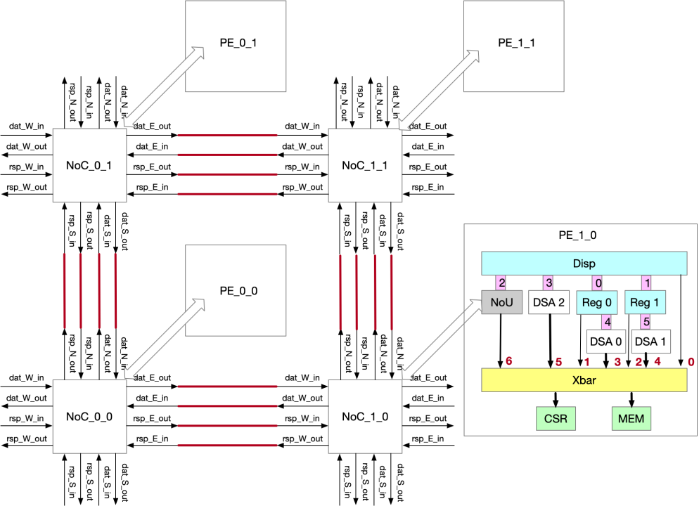

# Introduction
This document introduce the detail of TCG hardware configuration files (.yaml). Generally, the hardware configuration consist of two types of configuration yaml files which are chip.yaml and pe_x_x.yaml. Chip.yaml defines the chip-levlel configuration, such as PE-array topology, address mapping from host size, shell micro-architecture, and so on. Pe.yaml defines PE micro-architeture like rv-cluster topology, dsa types and shape, memory size.

For homogenous architecture, only one pe.yaml file is required. While for heterogenous architecture, each PE has a corresponding pe_x_x.yaml file. Following sections will introduce the details of hardware configuration based on the example architecture below.


<center>Figure 1. Example architecture. 2x2 homogenous architecture, each PE consists of rv cluster with one dispatcher and two regular RV, three DSAs, NoU for NoC interconnection, AXI Xbar for intra-PE communication, CSR module for debuging, and sram.</center>  
  
# PE Configuration
A complete configuration file for PE is summarized as follows:
```yaml
version: 1.0
type: homogeneous
dispatcher:
  - type: e906
regular:
  - type: e906
rvcluster: # rv cluster topology
  num: 3
  config: ["dispatcher", "regular_0", "regular_1"]
  dispatcher: 
    - name: dispatcher 
      link:
      - dst: regular_0
        index: 0
        qid: 0
        type: xocc
        width: [32, 32] # cmd width, rsp width; depth is fixed to 32
      - dst: regular_1
        index: 1
        qid: 1
        type: xocc
        width: [32, 32]
      - dst: nou
        index: 2
        qid: 2
        type: xocc
        width: [64, 64]
      - dst: dsa_2
        index: 3
        qid: 3
        type: xocc
        width: [32, 32]
      - dst: memory
        type: axi
        index: 0
        width: 32
        mem:
      toolchain:
        imem_s_addr: 0x02000000
        imem_range: 0x20000
        dmem_s_addr: 0x02020000
        dmem_range: 0x20000
        stack_addr: 0x0203c000
  regular:
    - name: regular_0
      link:
      - dst: dispatcher
        index: 0
        qid: 0
        type: xocc
        width: [32, 32]
      - dst: dsa_0
        index: 4
        qid: 1
        type: xocc
        width: [96, 32]
      - dst: memory
        index: 1
        type: axi
        width: 32
        mem:
      toolchain:
        imem_s_addr: 0x02100000
        imem_range: 0x20000
        dmem_s_addr: 0x02120000
        dmem_range: 0x20000
        stack_addr: 0x0213c000
    - name: regular_1
      link:
      - dst: dispatcher
        index: 1
        qid: 0
        type: xocc
        width: [32, 32]
      - dst: dsa_1
        index: 5
        qid: 1
        type: xocc
        width: [32, 32]
      - dst: memory
        index: 2
        type: axi
        width: 32
        mem:
      toolchain:
        imem_s_addr: 0x02200000
        imem_range: 0x20000
        dmem_s_addr: 0x02220000
        dmem_range: 0x20000
        stack_addr: 0x0223c000
memory:
- size: 524288 # unit: Byte
  type: scratchpad # or 3DMem
  bankNum: 4
  index: 0
  memory_map:
    - name: sram_0
      start_addr: 32'h0200_0000
      end_addr: 32'h0210_0000
    - name: sram_1
      start_addr: 32'h0210_0000
      end_addr: 32'h0220_0000
    - name: sram_2
      start_addr: 32'h0220_0000
      end_addr: 32'h0230_0000
    - name: sram_3
      start_addr: 32'h0230_0000
      end_addr: 32'h0240_0000
- size: 4096
  type: csr
  bankNum:
  index: 1
  memory_map:
    - name: csr
      start_addr: 32'hc000_0000
      end_addr: 32'hc010_0000
dsa:  # dsa topology, xocc port is ignored
  num: 2
  config: ["dsa_0", "dsa_1", "dsa_2", "nou"]
  dummy_dsa:
    - name: dsa_0
      link:
      - dst: memory
        index: 3
        type: axi
        width: 1024
        port: rw
        mem:
      - dst: regular_0
        index: 4
        type: xocc
    - name: dsa_1
      link:
      - dst: memory
        index: 4
        type: axi
        width: 1024
        port: rw
        mem:
      - dst: regular_1
        index: 5
        type: xocc
    - name: dsa_2
      link:
      - dst: memory
        index: 5
        type: axi
        width: 1024
        port: rw
        mem:
      - dst: dispatcher
        index: 3
        type: xocc
  nou:
    - name: nou
      link:
      - dst: memory
        index: 6
        type: axi
        width: 512
        port: rw
        mem:
      - dst: noc_0
        index: 0
        type: noc
        width: 512
        mem:
      - dst: dispatcher
        index: 2
        type: xocc
```

<center>Figure 2. Microarch of PE</center>  
Generally, this file includes configuration of:

- RV cluster
- DSA integration
- memory subsystem
## RV cluster
The RV cluster part specifies configuration like the number of RVs, XoCC interconnection, and data path to memory, and software toolchain related information.
```yaml
rvcluster: # rv cluster topology
  num: 3
  config: ["dispatcher", "regular_0", "regular_1"]
```
As illustrated in Figure 1, RV cluster consists of three RISC-V core, which are one dispatcher RV and two regular RV. The "dispatcher" and "regular" item describe the details of dispatcher core and regular core, respectively.
```yaml
dispatcher: 
    - name: dispatcher 
      link:
      - dst: regular_0
        index: 0
        qid: 0
        type: xocc
        width: [32, 32] # cmd width, rsp width; depth is fixed to 32
      - dst: regular_1
        index: 1
        qid: 1
        type: xocc
        width: [32, 32]
      - dst: nou
        index: 2
        qid: 2
        type: xocc
        width: [64, 64]
      - dst: dsa_2
        index: 3
        qid: 3
        type: xocc
        width: [32, 32]
      - dst: memory
        type: axi
        index: 0
        width: 32
        mem:
      toolchain:
        imem_s_addr: 0x02000000
        imem_range: 0x20000
        dmem_s_addr: 0x02020000
        dmem_range: 0x20000
        stack_addr: 0x0203c000
```
As depictedin Figure 2, two regular RV, a nou unit, and a DSA module are connected to dispatcher RV via XoCC. The "link" item describes the XoCC and data bus connection. For example, regular_0 is connected to dispatcher via XoCC. Thus, the link "type" is "xocc", and the commmand width and response width of XoCC are defined by a list ([32, 32] in the example). The "qid" refers to the queue ID of XoCC in dispatcher side. The "index" refers to the order of XoCC connection, which are depicted with purple in Figure 1. Generally, the rule for assigning index follows: xocc between dispatcher and regular rv, then dsa connected to dispatcher, and then dsa connected to regular RV. Note that the string in "dst" must match the name of module connected. 
For link type of "axi", this means RV is connected to memory susbsystem with AXI interface. The rule for index assignment is similar to XoCC indexing.
The "toolchain" item in RV defines information for program compilation. Specifically, these information are used in linker file (.lcf).
## DSA
"DSA" item refers to configuration for instantiated DSAs. These DSAs can be some IPs for particular function such as nou for NoC routing, or any customized accelerators like GEMM, VPU.  Inside "dsa" item, "num" means the number of DSA modules, "config" describes the names of all DSA modules. Remains are the detailed information for these DSAs, which may be different for each other.
```yaml
dsa:  # dsa topology, xocc port is ignored
  num: 3
  config: ["dsa_0", "dsa_1", "dsa_2", "nou"]
  dummy_dsa:
    - name: dsa_0
      link:
      - dst: memory
        index: 3
        type: axi
        width: 1024
        port: rw
        mem:
      - dst: regular_0
        index: 4
        type: xocc
    - name: dsa_1
      link:
      - dst: memory
        index: 4
        type: axi
        width: 1024
        port: rw
        mem:
      - dst: regular_1
        index: 5
        type: xocc
    - name: dsa_2
      link:
      - dst: memory
        index: 5
        type: axi
        width: 1024
        port: rw
        mem:
      - dst: dispatcher
        index: 3
        type: xocc
  nou:
    - name: nou
      link:
      - dst: memory
        index: 6
        type: axi
        width: 512
        port: rw
        mem:
      - dst: noc_0
        index: 0
        type: noc
        width: 512
        mem:
      - dst: dispatcher
        index: 2
        type: xocc

```
Basically, each item contains the "link" type and configurations including XoCC interface and inteface for memory access (axi in the above example). As demonstrated, "dummy_dsa" refers to the DSA type. Each DSA type can be instantiated multiple times (dsa_0/1/2 in the above example). The description of "link " is similar to that in "RV cluster". 
 Each dsa type may contain some particular configurations. For example, GEMM may have configurations like GEMM size, buffer size, number of cores. You must add corresponding Mako code to support these customized configurations.
## Memory
The "memory" part descirbe configuration for memory subsystem.  Generally, the memory subsystem refers to SRAM, CSR and AXI xbar. 
```yaml
memory:
- size: 1048576 # unit: Byte
  type: scratchpad # or 3DMem
  bankNum: 4
  index: 0
  memory_map:
    - name: sram_0
      start_addr: 32'h0200_0000
      end_addr: 32'h0210_0000
    - name: sram_1
      start_addr: 32'h0210_0000
      end_addr: 32'h0220_0000
    - name: sram_2
      start_addr: 32'h0220_0000
      end_addr: 32'h0230_0000
    - name: sram_3
      start_addr: 32'h0230_0000
      end_addr: 32'h0240_0000
- size: 4096
  type: csr
  bankNum:
  index: 1
  memory_map:
    - name: csr
      start_addr: 32'hc000_0000
      end_addr: 32'hc010_0000
```
In the example above, "size" of the first memory item is 1MB, which is 4 banked (bankNum) scratchpad SRAM (type). The "memory map" specifies address mapping for this memory. The second memory item is CSR whose "size" is 4KB.
TCG will generate AXI xbar by parsing "memory" item and AXI connection in RV cluster and DSAs.
# Chip Configuration
```yaml
version: 1.0
type: homogeneous
topology: [2,2]
link:
- bandwidth: 128
  currentBandwidth: 0.0
  direction: bi
  dst: 1
  index: 4
  isBusy: false
  latency: 1
  src: 0
- bandwidth: 128
  currentBandwidth: 0.0
  direction: bi
  dst: 2
  index: 5
  isBusy: false
  latency: 1
  src: 0
- bandwidth: 128
  currentBandwidth: 0.0
  direction: bi
  dst: 3
  index: 6
  isBusy: false
  latency: 1
  src: 1
- bandwidth: 128
  currentBandwidth: 0.0
  direction: bi
  dst: 3
  index: 7
  isBusy: false
  latency: 1
  src: 2
memory:
- currentData: []
  index: -1
  memSize: 0
pe:
- computeCapacityTensor: 1024
  computeCapacityVector: 32
  currentMem: 0
  currentOpIndex: -1
  index: 0
  isBusy: false
  memSize: 524288
  name: thrive_pe_0_0
  type: thrive_pe
  x: 0
  y: 0
- computeCapacityTensor: 1024
  computeCapacityVector: 32
  currentMem: 0
  currentOpIndex: -1
  index: 1
  isBusy: false
  memSize: 524288
  name: thrive_pe_1_0
  type: thrive_pe
  x: 1
  y: 0
- computeCapacityTensor: 1024
  computeCapacityVector: 32
  currentMem: 0
  currentOpIndex: -1
  index: 2
  isBusy: false
  memSize: 524288
  name: thrive_pe_0_1
  type: thrive_pe
  x: 0
  y: 1
- computeCapacityTensor: 1024
  computeCapacityVector: 32
  currentMem: 0
  currentOpIndex: -1
  index: 3
  isBusy: false
  memSize: 524288
  name: thrive_pe_1_1
  type: thrive_pe
  x: 1
  y: 1
memory_map:
  - name: sys_reg
    start_addr: 32'hC000_0000
    end_addr: 32'hC010_0000
  - name: pe_0_0
    start_addr: 32'h0000_0000
    end_addr: 32'h1000_0000
  - name: pe_1_0
    start_addr: 32'h1000_0000
    end_addr: 32'h2000_0000
  - name: pe_0_1
    start_addr: 32'h2000_0000
    end_addr: 32'h3000_0000
  - name: pe_1_1
    start_addr: 32'h3000_0000
    end_addr: 32'h4000_0000

```

# Steps to generate codes with mako
You can generate your own code with configuration files ready. Here is the way to run our demo:
```tcl
cd script/
make demo
```
You can reference the steps in Makefile to write your own command.  